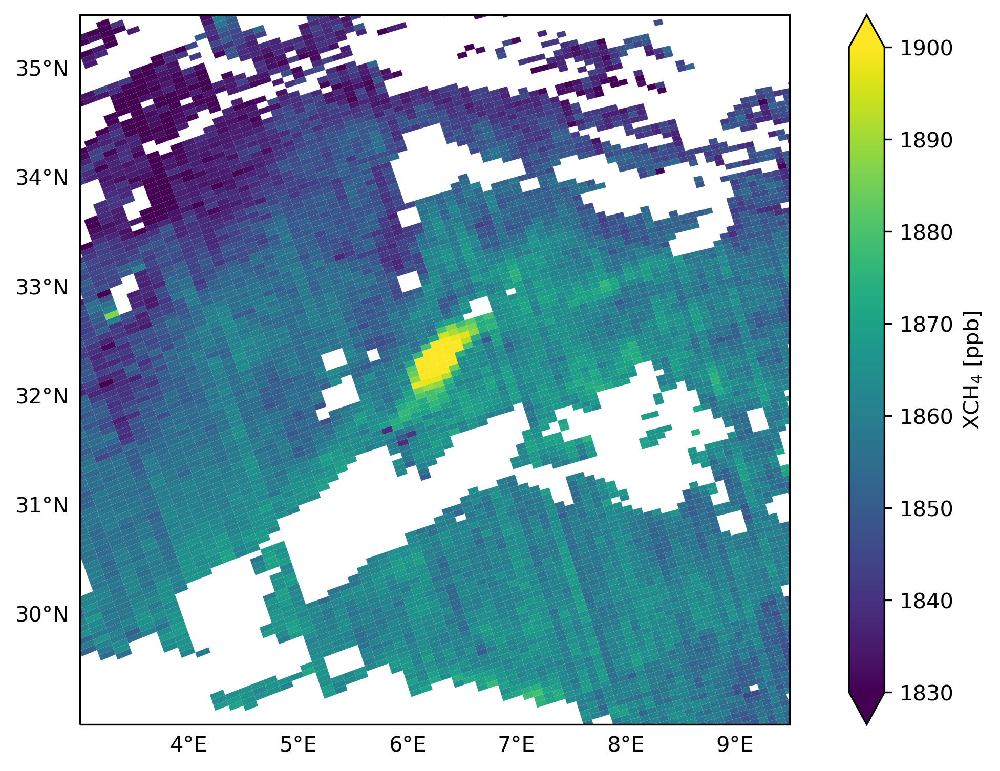

## Product User Manual for the Blended TROPOMI+GOSAT Product
Nicholas Balasus\
31 January 2024

### (1) Introduction
The blended TROPOMI+GOSAT files are formed by applying the correction described in Balasus et al. (2023) to the variable `methane_mixing_ratio_bias_corrected` in the operational TROPOMI files. This adds the new variable of `methane_mixing_ratio_blended`. The correction is applicable to the files with a processor version of 02.04.00, 02.05.00, or 02.06.00 and to observations in those files with `qa_value` == 1.0. The operational TROPOMI files are sourced from the [Copernicus Data Space Ecosystem](https://dataspace.copernicus.eu). The following sections describe downloading the data, the file names, the file contents, and how to plot the file contents using Python.

### (2) Downloading the data
 -

### (3) File names
An example file name is:
```
S5P_BLND_L2__CH4____20191215T112041_20191215T130211_11252_03_020400_20230614T125420.nc
```
- S5P = Sentinel-5 Precursor, the mission name
- BLND = indicates the blended TROPOMI+GOSAT product
- L2 = level 2 data (i.e., individual retrievals)
- CH4 = methane files
- 20191215T112041 = start time of the granule in UTC
- 20191215T130211 = end time of the granule in UTC
- 11252 = the orbit number
- 03 = collection number
- 020400 = processor version
- 20230614T125420 = file generation time in UTC

The only differences between the original operational file name (below) and the blended TROPOMI+GOSAT file name is the replacement of the processing type (RPRO/reprocessed or OFFL/offline) with BLND and the overwriting of the file generation time.
```
S5P_RPRO_L2__CH4____20191215T112041_20191215T130211_11252_03_020400_20221119T003414.nc
```

### (4) File contents
The files contain the subset of soundings from the OFFL/RPRO files that have a `qa_value` == 1.0. All other observations are excluded because the blended TROPOMI+GOSAT correction is not valid to apply to them. Additionally, only a subset of variables is included in the BLND files (and they no longer reside in netCDF groups). The files have dimensions of `nobs`, `layer`, and `corner`. All variables are the same as described in the TROPOMI methane PUM except for `methane_mixing_ratio_blended` (derived in this work) and `time_utc` (expanded to all observations in these files). The following is an example for the orbit number 11252 file listed above.
```
<class 'netCDF4._netCDF4.Dataset'>
root group (NETCDF4 data model, file format HDF5):
    Title: Blended TROPOMI+GOSAT Methane Product
    Contact: Nicholas Balasus (nicholasbalasus@g.harvard.edu)
    dimensions(sizes): nobs(136308), layer(12), corner(4)
    variables(dimensions): uint8 qa_value(nobs), float32 latitude(nobs), float32 longitude(nobs), float32 methane_mixing_ratio(nobs), float32 methane_mixing_ratio_precision(nobs), float32 methane_mixing_ratio_bias_corrected(nobs), <class 'str'> time_utc(nobs), float32 latitude_bounds(nobs, corner), float32 longitude_bounds(nobs, corner), float32 chi_square_SWIR(nobs), float32 surface_albedo_SWIR(nobs), float32 surface_albedo_NIR(nobs), float32 surface_albedo_SWIR_precision(nobs), float32 surface_albedo_NIR_precision(nobs), float32 aerosol_size(nobs), float32 aerosol_size_precision(nobs), float32 column_averaging_kernel(nobs, layer), float32 surface_altitude(nobs), float32 surface_altitude_precision(nobs), uint8 surface_classification(nobs), float32 surface_pressure(nobs), float32 pressure_interval(nobs), float32 reflectance_cirrus_VIIRS_SWIR(nobs), float32 methane_profile_apriori(nobs, layer), float32 dry_air_subcolumns(nobs, layer), float32 methane_mixing_ratio_blended(nobs)
    groups: 
```

### (5) Plotting
Included here is a simple example for how to plot the data in Python. The pixels are shown as their full extents (using latitude and longitude bounds), though a scatter plot of the latitude and longitude centers can be used for a quick look. The optional coastal filter from Balasus et al. (2023) is used.

```
import matplotlib.pyplot as plt
import numpy as np
import cartopy.crs as ccrs
from matplotlib.collections import PolyCollection
from netCDF4 import Dataset

fig, ax = plt.subplots(figsize=(10,6),
                       subplot_kw={"projection": ccrs.PlateCarree()})

file = "S5P_BLND_L2__CH4____20191215T112041_20191215T130211_11252_03_020400_20230614T125420.nc"
with Dataset(file) as ds:
    # Optional coastal filter from Balasus et al. (2023)
    sc = (ds["surface_classification"][:] & 0x03).astype(int)
    valid_idx = ~((sc == 3) | ((sc == 2) & (ds["chi_square_SWIR"][:] > 20000)))
    lon_bounds = ds["longitude_bounds"][:][valid_idx]
    lat_bounds = ds["latitude_bounds"][:][valid_idx]
    xch4_blended = ds["methane_mixing_ratio_blended"][:][valid_idx]

verts = [np.column_stack((lon_bounds[i, :], lat_bounds[i, :]))
         for i in range(len(xch4_blended))]
pc = ax.add_collection(PolyCollection(verts, array=xch4_blended))
pc.set_clim(vmin=1830, vmax=1900)

ax.coastlines()
ax.set_extent([3.0, 9.5, 29.0, 35.5], crs=ccrs.PlateCarree())
gl = ax.gridlines(draw_labels=True, zorder=-1, linewidth=0)
gl.top_labels = gl.right_labels = False
plt.colorbar(pc, ax=ax, extend="both", label=r"XCH$_4$ [ppb]")
```


### (6) Contact and acknowledgements

If you have questions about the data, please contact me at `nicholasbalasus@g.harvard.edu`. Additionally, please contact me if you plan to use the data in your research so that proper acknowledgements can be made.